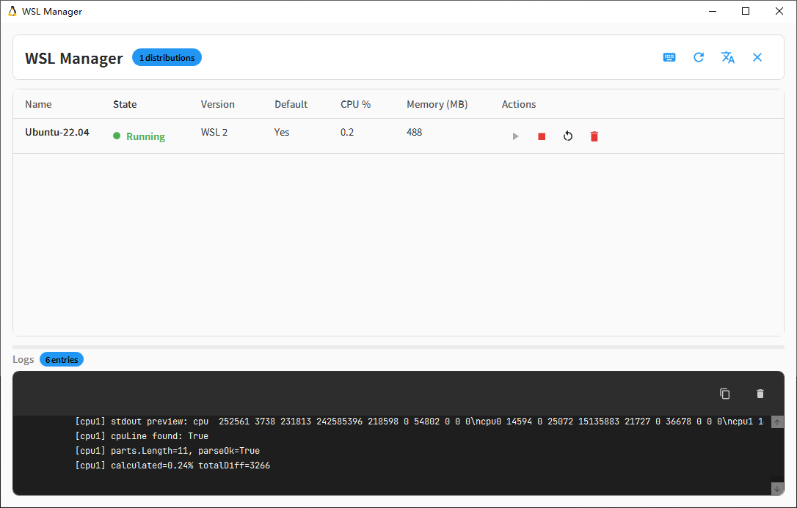

# WSL Manager

A WPF desktop application for managing Windows Subsystem for Linux (WSL) distributions.



## Features

- **Distribution Management** — Start, stop, and unregister WSL distributions through a clean GUI
- **Import & Export** — Create TAR backups of distributions and import from existing archives
- **Resource Monitoring** — Real-time CPU and memory usage charts via LiveCharts2
- **WSL Service Control** — Start and stop the WSL service (`LxssManager`, `wslservice`) directly from the app
- **System Tray** — Minimize to tray with Hardcodet.NotifyIcon; close hides instead of exits
- **Themes** — Toggle between dark and light modes at runtime
- **Localization** — Multi-language support (English, Chinese)

## Requirements

- Windows 10/11 with WSL installed
- [.NET 8 SDK](https://dotnet.microsoft.com/download/dotnet/8.0)
- [WiX Toolset v4](https://wixtoolset.org/) (for building the MSI installer):
  ```powershell
  dotnet tool install --global wix
  ```

## Build & Run

```powershell
# Build the solution
dotnet build WSLManager.sln

# Run the application
dotnet run --project src/WSLManager

# Full release build + MSI installer (requires Administrator)
powershell -ExecutionPolicy Bypass -File build.ps1
```

## Architecture

| Project | Purpose |
|---------|---------|
| `src/WSLManager` | WPF entry point — views, view models, converters, themes |
| `src/WSLManager.Core` | Models and services with no WPF dependency |
| `src/WSLManager.Setup` | WiX v4 MSI installer |

### Key Services

- **`WslService`** — Shells out to `wsl.exe` for listing, starting, stopping, exporting, importing, and unregistering distributions. Controls Windows services via `ServiceController`.
- **`ResourceMonitorService`** — Polls WSL-related processes and exposes resource metrics through a rolling history (~120 samples).
- **`SettingsService`** — Persists `AppSettings` to JSON in the user's local app data folder.

### UI & MVVM

- `MainViewModel` drives the main window using `CommunityToolkit.Mvvm` source generators.
- Charts bind to `ObservableCollection<ObservableValue>` updated on a timer.
- UI thread dispatching is handled via `Application.Current.Dispatcher.Invoke` for timer-based updates.

## Project Structure

```
WSLManager.sln
src/
├── WSLManager/
│   ├── Views/
│   ├── ViewModels/
│   ├── Converters/
│   ├── Themes/
│   ├── Services/
│   └── Resources/
├── WSLManager.Core/
│   ├── Models/
│   └── Services/
└── WSLManager.Setup/
    └── Product.wxs
```

## License

MIT
